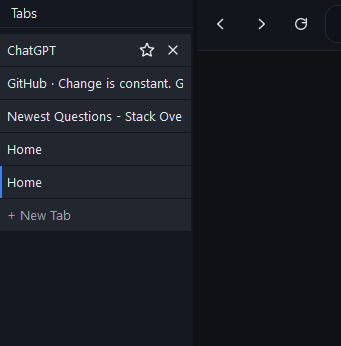
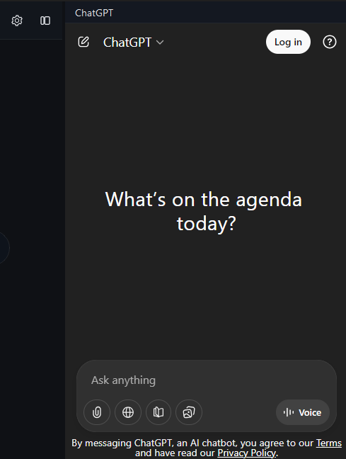
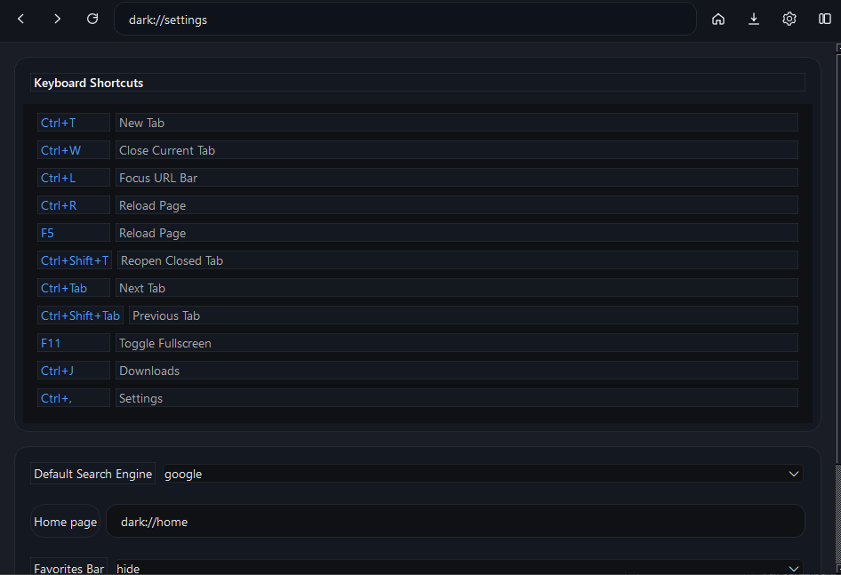
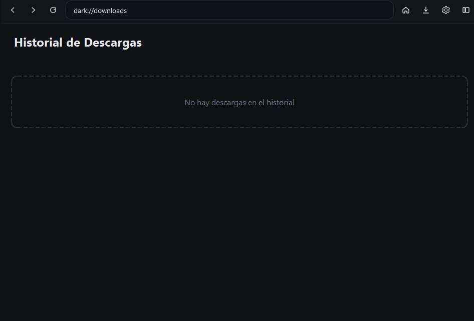

# DarkBrowser
Dark Browser es un navegador web que funciona bien(no) y esta hecho en python(usando PyQt6)

Es un proyecto simple(muy simple) que simplemente usa python y PyQt6 y su "PyQt6-WebEngine" que es basicamente chromiun pero para interfaz de usuario en python con PyQt6, sobra decir que el proyecto es open source, y bueno aqui un resumen de sus 'features' si es que se les puede llamar asi...

## ADVERTENCIA

No es recomendable usarlo con cuentas personales y demas es solo un `pointless software` osea que no creo mantenerlo todo el tiempo a no ser que se vuelva popular y tampoco creo que sea muy popular o util por dios esta hecho en python con PyQt, cuando deberia haberse hecho con electron.js, pero tengo muy poco tiempo para romperme el cerebro con la estupides de no poder centrar un `div`, asi que eso.

## Tabs Verticales

No es como que hay unos 10 navegadores con tabs verticales aun asi es una 'feature'

## Integracion con ChatGPT

El 'navegador' tiene un sidebar con la pagina de chat gpt cargada y al seleccionar un texto se puede dar click derecho para "enviarlo a chat gpt' no se envia nada se copia al portapapeles y se abre el sidebar de chat gpt XD pq no queria inyectar js por seguridad(y pereza).

## Favoritos y lo obvio

El navegador tiene una home page donde podras poner pins de tus paginas mas visitadas (tiene 3 puestas por defecto), ademas en las `Tabs Verticales` hell yeah... hay una estrellita que anclara como favorita esa tab a una barra que esta debajo de la parte superior de busqueda, esta no aparecera hasta que no se ponga como favorita una tab, ademas es customisable desde la configuracion.

## Config

Hablando de config, hay una tab de configuraion accesible desde un boton arriba a la derecha con un icono de configuracion o con el atajo Ctr+, si coma esto `,`, con todos los atajos de teclado (SI TIENE ATAJOS DE TECLADO ESTA PENSADO PARA SER MAYORMENTE KEYBOARD ONLY) y ademas configuraciones utiles como el search engine, la home page(si no quieres la que viene por defecto... mala persona si la quitas) barra de favoritos que es si se muestra o no la barra de favoritos, notificacions(si el navegador tiene unas  y no no tiene una api js para ello asi que eso) y debug and welcome que es basicamente una pantalla de bienvenida que deberia recalco el 'deberia' mostrarse al abrir el navegador por primera vez(espero)...

## Descargas

Tambien hay una pagina de descargas que muestra los archivos que has descargado sean imagenes o lo que sea, no muestra cuanto falta para terminar de descargar algo(por alguna razon que no entiendo no consegui hacerlo funcionar con qtwebengine) y es accesible desde el boton arriba a la derecha con el icono de descarga o con el atajo Ctr+J.

Y eso es `Dark Browser` un proyecto hecho para mi canal de youtube y que por alguna razon termino siendo ''''mejor'''' de lo que pensaba. si quieres contribuir aslo ademas necesito ayuda para la build para linux y mac porfa ayuda no tengo $2000 para comprarme una mac.
